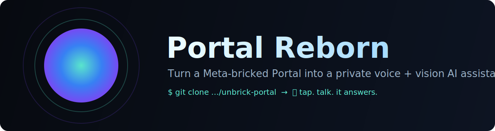
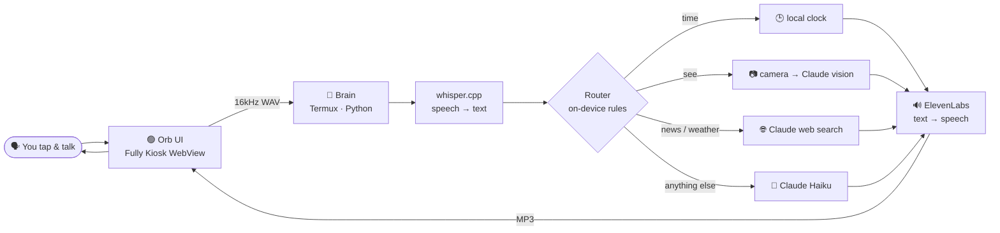

<div align="center">



<h1>unbrick-portal · Portal Reborn</h1>

<p><strong>Meta bricked your Portal. Bring it back — as a private voice + vision AI assistant that runs on the device itself.</strong></p>

<p>
  <a href="#-quick-start">Quick&nbsp;Start</a> ·
  <a href="docs/GUIDE.md">Full&nbsp;Guide</a> ·
  <a href="#-how-it-works">How&nbsp;it&nbsp;works</a> ·
  <a href="#-troubleshooting">Troubleshooting</a> ·
  <a href="#-faq">FAQ</a>
</p>

<p>
  
  
  
  
  
</p>

</div>

---

## 🛰️ What is this?

In 2022 Meta discontinued its **Portal** smart displays and shut down the cloud
services that ran them — turning perfectly good hardware into e-waste.

**unbrick-portal** repurposes that hardware into a **self-contained AI assistant**.
Walk up, tap the glowing orb, talk, and it answers out loud — and can even *see*
through the camera when you ask. The Portal does the listening, routing, and
orchestration **on its own hardware**; only the heavy thinking is handled by cloud
AI APIs you control.

> 🔴 **Reality check (read this):** this is a **DIY weekend project**, not a one-tap
> app. You'll need a computer, a USB-C cable, ~1 hour, and a willingness to follow
> step-by-step instructions and paste a few commands. It also uses **paid AI APIs**
> (typically a few dollars of usage). The [**Full Guide**](docs/GUIDE.md) is written
> for patient beginners — no prior coding knowledge assumed.

<div align="center">

<!-- 📹 Add a short demo GIF here: assets/demo.gif -->
<em>📹 Demo GIF coming soon — record your Portal answering a question and drop it in <code>assets/demo.gif</code>.</em>

</div>

---

## ✨ Features

- 🎙️ **Talk to it** — tap the orb, speak, hear a natural spoken reply.
- 👁️ **It can see** — ask "what do you see?" and the camera turns on *only then* (privacy-first).
- 🌐 **Knows current things** — live web search for news, weather, scores, prices.
- 🟢 **Reactive orb UI** — a calm animated face that pulses to your voice and its reply.
- 🔒 **Privacy-first** — the camera is off until you ask; your keys stay on your device.
- ⚡ **Fast** — ~2–4s responses.
- 🔁 **True appliance** — boots straight to the orb and restarts itself; no laptop needed once set up.
- 🧩 **Open & hackable** — small, readable code; swap the voice, the model, or the persona.

---

## 🧠 How it works

The Portal **orchestrates everything itself** and calls cloud AI only for the heavy lifting.



**On the device:** the orb UI, speech-to-text (whisper), and the router/glue.
**In the cloud (your keys):** Claude for answers/vision/search, ElevenLabs for the voice.

<details>
<summary>Why not run the AI fully on-device?</summary>

We tried — a small on-device language model (gemma 1B) was the original plan. On the
Portal's older chip it was **~60 seconds per reply** and unreliable. So routing stays
**on-device and instant** (simple rules), while the actual answers come from fast cloud
models. The device still does all the orchestration itself. (Revisiting on-device models
via the chip's AI accelerator is on the roadmap.)
</details>

---

## 🛒 What you'll need

| | |
|---|---|
| 📺 **A Meta Portal** | Built/tested on the **Portal Mini** (Android 10). Other Portals likely work with tweaks. It must still power on to its home screen. |
| 💻 **A computer** | Mac, Windows, or Linux — to run a few `adb` commands over USB. |
| 🔌 **A USB-C cable** | A **data** cable (not charge-only) to connect the Portal to your computer. |
| 🔑 **Anthropic API key** | For the AI brain. [console.anthropic.com](https://console.anthropic.com) · ~cents per chat. |
| 🔑 **ElevenLabs API key** | For the voice. [elevenlabs.io](https://elevenlabs.io) · has a free tier. |
| ⏱️ **~1 hour & patience** | One careful pass through the [guide](docs/GUIDE.md). |

---

## 🚀 Quick Start

> 👉 **New to this? Follow the [step-by-step Full Guide](docs/GUIDE.md)** — it explains
> every step with zero assumptions. The summary below is the 10,000-ft view.

1. **Get two API keys** (Anthropic + ElevenLabs).
2. **Enable ADB** on the Portal (Settings → tap build number 7×, then turn on *ADB Enabled*).
3. **On your computer**, install `adb` and sideload **Termux** + **Termux:API** + **Termux:Boot** + **Fully Kiosk** to the Portal.
4. **In Termux on the Portal**, install the project and run the one-shot setup:
   ```bash
   pkg install -y git && git clone https://github.com/MavericksStudio/unbrick-portal
   cd unbrick-portal && bash scripts/setup-termux.sh
   ```
5. **Add your keys** to `~/.portal-agent.env` (the setup script shows you how).
6. **Set Fully Kiosk** as the home launcher, pointed at `http://127.0.0.1:8088/`.
7. **Reboot.** It comes up to the talking orb. 🎉

Every one of these is spelled out, with screenshot-level detail, in the
**[Full Guide »](docs/GUIDE.md)**.

---

## 🗣️ Using it

- **Tap** the orb → it listens (orb turns green and reacts to your voice).
- **Tap again** → it thinks, then speaks the answer (orb pulses).
- Try: *"What's the capital of France?"*, *"What's the weather in Tokyo?"*,
  *"What do you see?"*, *"Tell me a joke."*

Make it yours: edit `brain.json` to change the **voice** (`tts_voice_id`), the
**model** (`claude_model`), or the **persona** (`persona`).

---

## 🔧 Troubleshooting

<details>
<summary><strong>The orb shows but nothing happens when I talk</strong></summary>

Check the brain is running and your keys are set. In Termux: `tail ~/brain-errors.log`.
A `401`/`402` means an API key is missing or unfunded.
</details>

<details>
<summary><strong>It won't search the web / gives old info</strong></summary>

Web search uses Claude's web-search tool (needs the Anthropic key). Make sure
`ANTHROPIC_API_KEY` is in `~/.portal-agent.env`.
</details>

<details>
<summary><strong>After a reboot my computer can't see the Portal over ADB</strong></summary>

A Portal reboot drops the ADB authorization. On the Portal: Settings → re-enable
**ADB Enabled** and accept the prompt. (The appliance itself doesn't need ADB — only
you do, for tweaks.)
</details>

<details>
<summary><strong>Microphone is blocked in the orb UI</strong></summary>

In Fully Kiosk → Web Content Settings, enable **Camera/Microphone Access**, then
restart Fully Kiosk so it re-detects the permission.
</details>

More in the [guide's troubleshooting section](docs/GUIDE.md#troubleshooting).

---

## ❓ FAQ

<details>
<summary><strong>Is it really free?</strong></summary>

The software is free and open source. The cloud AI is pay-as-you-go: Claude costs
roughly cents per conversation, and ElevenLabs has a free monthly tier. No Meta
account or subscription needed.
</details>

<details>
<summary><strong>Does the camera spy on me?</strong></summary>

No. The camera is **off** until you explicitly ask it to look ("what do you see?"),
then it grabs one frame and turns off again. Nothing is recorded or stored.
</details>

<details>
<summary><strong>I'm not technical. Can I really do this?</strong></summary>

If you can carefully follow instructions and copy-paste commands, yes. The
[Full Guide](docs/GUIDE.md) assumes no coding background. Budget an hour and don't skip steps.
</details>

<details>
<summary><strong>Will this work on the bigger Portal / Portal+ / Portal TV?</strong></summary>

It's built and tested on the **Portal Mini**. The others run similar Android-based
software and should work with minor tweaks — please open an issue (or PR!) with your results.
</details>

---

## 🗺️ Roadmap

- [ ] Always-on wake word ("Hey Portal") — no tap needed
- [ ] Revisit an on-device model using the chip's Hexagon AI accelerator
- [ ] Smart-home / tool integrations
- [ ] One-script installer for Windows users
- [ ] Custom character avatars (not just the orb)

Contributions welcome — see [issues](https://github.com/MavericksStudio/unbrick-portal/issues).

---

## 🙏 Acknowledgements

Built on the shoulders of great open source:

- **[be-more-agent](https://github.com/brenpoly/be-more-agent)** by brenpoly — the original
  local AI-agent project this was forked from (MIT).
- **[Termux](https://termux.dev)** — the Linux environment that makes this possible on Android.
- **[whisper.cpp](https://github.com/ggerganov/whisper.cpp)** — on-device speech-to-text.
- **[Fully Kiosk Browser](https://www.fully-kiosk.com)** — the kiosk WebView shell.
- **[Anthropic Claude](https://www.anthropic.com)** & **[ElevenLabs](https://elevenlabs.io)** — the cloud brain and voice.

---

## 📄 License

MIT — see [LICENSE](LICENSE). Do what you like; no warranty.

> ⚠️ **Not affiliated with, endorsed by, or sponsored by Meta.** "Portal" is a
> trademark of Meta Platforms, Inc. This is an independent community project for
> repurposing hardware you already own.

<div align="center">
<sub>Made with 🤍 for everyone with a "dead" Portal on a shelf. If this helped, ⭐ the repo so others can find it.</sub>
</div>
